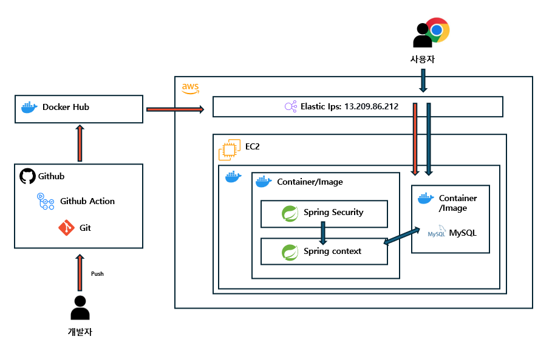

## 📜한달인턴 8기 과제
[📌접속 링크](http://3.37.51.23:8080/swagger-ui/index.html)
- `Junit5`를 이용한 테스트 코드 작성법 이해
- `Spring Security`를 이용한 `Filter`에 대한 이해
- `JWT`와 구체적인 알고리즘의 이해
- `PR` 날려보기
- `리뷰` 바탕으로 `개선`하기
- `EC2`에 배포해보기
- `Swagger UI` 로 접속 가능하게 하기

## 🖥️시스템 구성도
 <br/>

## 🖥️개발환경
### 🧷사용 언어/라이브러리


### 🧷운용 환경

<br/>


### 🧷개발 환경 & 데이터베이스

 <br/>


## 🗂️프로젝트 구조
```bash
'homework_login'                                        # 주요 패키지
├── 'common'                                            # 공통 유틸리티 클래스
│   ├── JwtUtil.java                                    # JWT 토큰 생성 및 검증
│   └── UserValidationCheck.java                        # 사용자 유효성 검사
├── 'config'                                            # 설정 관련 클래스
│   ├── PasswordConfig.java                             # 비밀번호 설정
│   ├── SwaggerConfig.java                              # Swagger API 문서화 설정
│   └── WebSecurityConfig.java                          # Spring Security 설정
├── 'controller'                                        # 컨트롤러 (REST API 엔드포인트)
│   └── UserController.java                             # 사용자 관련 API 엔드포인트
├── 'dto'                                               # 데이터 전송 객체 (DTO)
│   ├── 'request'                                       # 요청 데이터 DTO
│   │   ├── SignInRequestDto.java                       # 로그인 요청 데이터
│   │   └── SignUpRequestDto.java                       # 회원가입 요청 데이터
│   ├── 'response'                                      # 응답 데이터 DTO
│   │   ├── AuthorDto.java                              # 사용자 권한 정보
│   │   ├── ErrorResponseDto.java                       # 오류 응답 데이터
│   │   ├── SignInResponseDto.java                      # 로그인 응답 데이터
│   │   └── SignUpResponseDto.java                      # 회원가입 응답 데이터
│   └── 'security'                                      # Spring Security 관련 DTO
│       ├── UserDetailsImpl.java                        # 사용자 인증 정보 구현
│       └── UserDetailsServiceImpl.java                 # 사용자 인증 서비스 구현
├── 'dummy'                                             # Mock 데이터 및 테스트 유틸리티
│   ├── MockUser.java                                   # 사용자 Mock 객체
│   ├── SecurityMockUser.java                           # Security 관련 Mock 객체
│   └── WithCustomMockUserSecurityContextFactory.java   # 커스텀 Mock 보안 컨텍스트
├── 'entity'                                            # 데이터베이스 엔터티 클래스
│   ├── Timestamped.java                                # 공통 시간 속성 엔터티
│   └── User.java                                       # 사용자 엔터티
├── 'enums'                                             # 열거형 클래스
│   ├── ErrorCode.java                                  # 오류 코드 정의
│   └── UserRole.java                                   # 사용자 역할 정의
├── 'exception'                                         # 예외 처리 클래스
│   ├── BusinessException.java                          # 비즈니스 로직 예외
│   └── GlobalExceptionHandler.java                     # 전역 예외 처리기
├── 'filter'                                            # 필터 클래스
│   ├── JwtAuthenticationFilter.java                    # JWT 인증 필터
│   └── JwtAuthorizationFilter.java                     # JWT 권한 부여 필터
├── 'repository'                                        # JPA Repository 인터페이스
│   └── UserRepository.java                             # 사용자 관련 DB 작업 인터페이스
└── 'service'                                           # 서비스 클래스
    └── UserService.java                                # 사용자 비즈니스 로직
```